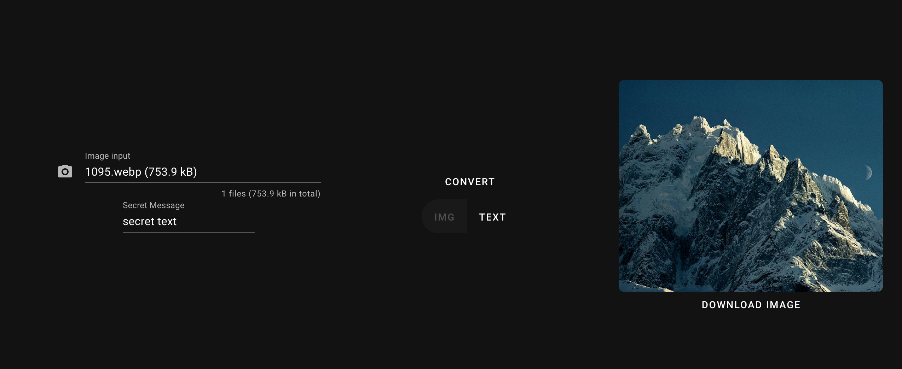

# Image crypting

This project is a POC for a college project, presenting steganography for hiding data in an image.

### install dependencies
`npm install`

### run locally
`npm run dev`

### demo

